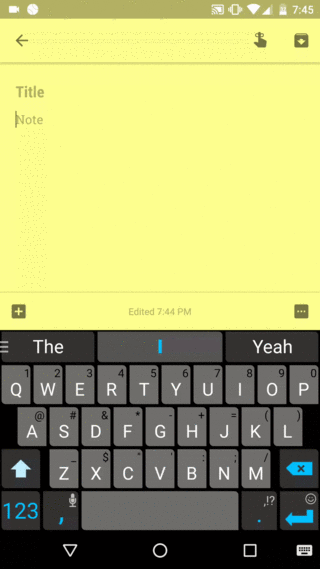

# Momentary

> Enter today's date into an Android buffer with two clicks.

## Overview

    

[Momentary](https://play.google.com/store/apps/details?id=com.samsudar.momentary)
is an Android keyboard with one function: entering today's date. I find myself
entering today's date multiple times a day when I'm using my phone.  Under
normal circumstances this is a pain to type. `2016-05-25`, for example, is at
least 10 clicks, and this is even worse if you're relying on long presses.

Momentary to the rescue!

When you select Momentary as the input method, it enters today's date and
immediately returns to the previous input method. It takes just a moment.

    

## Download

Momentary is available on [Google
Play](https://play.google.com/store/apps/details?id=com.samsudar.momentary) as
well as [on my website](https://samsudar.com/static/bin/momentary_v1-0.apk).

## Format and Customization

At the moment, only the `yyyy-mm-dd` format is supported. You can change the
delimiter from `-` to a string of your choosing (e.g. to `/` if you prefer
`2016/05/25`) in the settings page. No escaping is performed, however, so be
careful.
